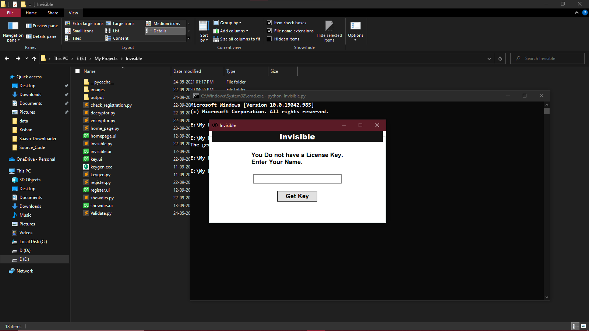
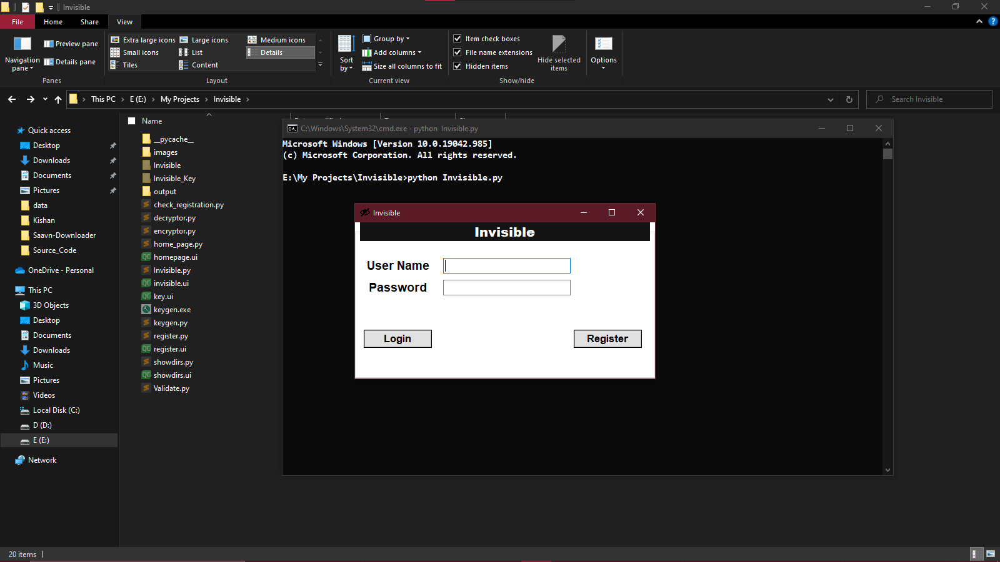
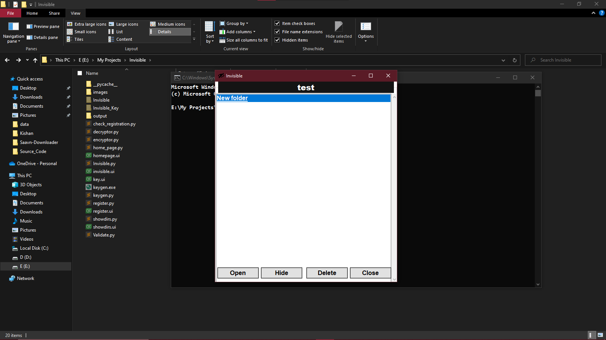

# Invisible
- It is python based GUI software that Encrypts and Hide confidential files in local system which is impossible to Decrypt without password.
## Functionality 
- Hide/Unhide multiple directory into system 
- Backup/Restore folder in any removable media
- Multiuser support by registering users ( Can't change password or delete user for now )
## Installation 
```sh
pip install -r requirements.txt
```
- Run 
```sh 
python Invisible.py
```
## Set Registration 
- Add "toaddr" and "fromaddr" and also generate app password for gmail and add it in "Validate.py" module to get key in your email
- At initial start of software, it ask for registration key which is generate by keygen.exe or keygen.py module by entering text which you received by mail.

## Snapshots
- Initial start

- Login

- User Home

- Hidden Directories 

